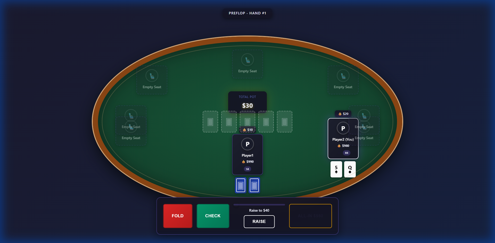
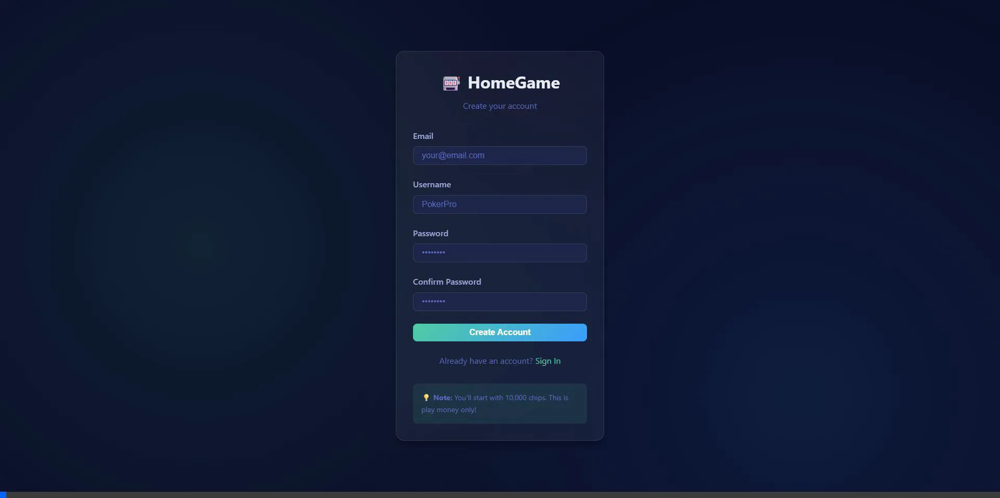
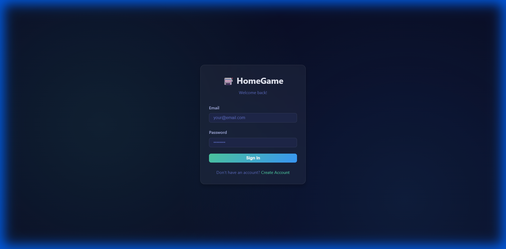
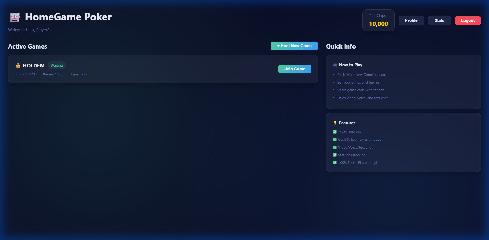
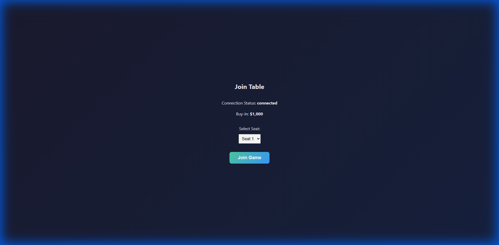

# 🎰 HomeGame - Real-Time Online Poker

**Play Texas Hold'em poker with friends in real-time** - A multiplayer poker platform powered by Supabase Realtime with beautiful UI, live game synchronization, and comprehensive statistics tracking.



---

## 🎮 Features

### ✅ Core Gameplay
- **Real-Time Multiplayer** - Play Texas Hold'em with 2-9 players
- **Instant Synchronization** - Game state updates in <100ms via Supabase Realtime
- **Full Poker Engine** - Complete Texas Hold'em rules including:
  - Blinds, betting rounds, and hand evaluation
  - Side pots and all-in scenarios
  - Automatic hand progression (Preflop → Flop → Turn → River → Showdown)

### 📊 Player Management  
- **User Accounts** - Secure authentication with Supabase Auth
- **Statistics Tracking** - Comprehensive game history and performance metrics
- **Leaderboards** - Compare your stats with other players
- **Starting Chips** - Each player starts with 10,000 play money chips

### 🎯 Game Modes
- **Cash Games** - Flexible buy-ins and blinds
- **Tournament Mode** - Structured tournaments _(coming soon)_

### 🎨 Beautiful UI
- **Poker Table View** - Realistic poker table with player positions
- **Live Updates** - See opponents' actions in real-time
- **Responsive Design** - Play on desktop or mobile

---

## 🏗️ Architecture

**Modern Realtime Architecture:**
- **Backend**: Supabase (Authentication, PostgreSQL, Realtime)
- **Game Hosting**: Host-authoritative model (one player runs the poker engine)
- **State Sync**: Supabase Realtime for instant game state synchronization
- **Action Flow**: Players submit actions → Host processes → State broadcast to all



**Benefits:**
- ✅ No complex server deployment
- ✅ Minimal infrastructure costs (Supabase free tier)
- ✅ Low latency (<100ms game updates)
- ✅ Works across all networks (no WebRTC NAT issues)
- ✅ Easy to debug and maintain

---

## 🚀 Tech Stack

### Frontend
- **React 19** + **TypeScript** - Modern, type-safe development
- **Vite** - Lightning-fast build tool
- **Redux Toolkit** - State management
- **React Router** - Client-side routing
- **Supabase JS Client** - Database and realtime subscriptions
- **Pokersolver** - Professional poker hand evaluation

### Backend (Supabase)
- **Supabase Auth** - User authentication and session management
- **PostgreSQL** - Relational database with Row Level Security
- **Super base Realtime** - WebSocket-based realtime subscriptions
- **Supabase Storage** - Avatar image storage

---

## 📋 Prerequisites

Before you begin, ensure you have:

1. **Node.js** (v18 or higher) - [Download here](https://nodejs.org/)
2. **npm** or **yarn** package manager
3. **Supabase Account** - [Free tier available](https://supabase.com)
4. **Git** - For cloning the repository

---

## 🛠️ Installation & Setup

### Step 1: Clone the Repository

```bash
git clone https://github.com/yourusername/HomeGame.git
cd HomeGame
npm install
```

### Step 2: Set Up Supabase Project

#### 2.1 Create a New Project
1. Go to [supabase.com](https://supabase.com) and sign in
2. Click **"New Project"**
3. Choose an organization (or create one)
4. Fill in project details:
   - **Name**: HomeGame (or your choice)
   - **Database Password**: Choose a strong password
   - **Region**: Select closest to you
5. Click **"Create new project"** and wait 1-2 minutes

#### 2.2 Run Database Migrations
The database schema is split into multiple migration files for organization:

1. Open your Supabase project dashboard
2. Navigate to **SQL Editor**
3. Run migrations in order:

**First - Core Schema:**
```bash
# Open supabase/migrations/initial_schema.sql
# Copy entire contents
# Paste in SQL Editor and click "Run"
```

**Second - Player Actions Table:**
```bash
# Open supabase/migrations/add_player_actions.sql
# Copy entire contents  
# Paste in SQL Editor and click "Run"
```

**Third - Enable Realtime on game_participants:**
```sql
-- Run this in SQL Editor
ALTER PUBLICATION supabase_realtime ADD TABLE game_participants;
```

#### 2.3 Configure Storage for Avatars
1. Go to **Storage** in Supabase dashboard
2. Click **"Create a new bucket"**
3. Name it: `avatars`
4. Set **Public bucket**: `ON`
5. Click **"Create bucket"**

####2.4 Get API Credentials
1. Go to **Settings** → **API** in Supabase dashboard
2. Copy your **Project URL** (e.g., `https://abc defg.supabase.co`)
3. Copy your **anon/public** API key

### Step 3: Configure Environment Variables

1. Copy the example environment file:
   ```bash
   cp .env.local.example .env.local
   ```

2. Edit `.env.local` with your credentials:
   ```env
   VITE_SUPABASE_URL=https://your-project-id.supabase.co
   VITE_SUPABASE_ANON_KEY=your-anon-key-here
   ```

⚠️ **Important**: Never commit `.env.local` to version control!

### Step 4: Start the Development Server

```bash
npm run dev
```

The app will be available at **http://localhost:5173**

---

## 🎮 How to Play

### Creating an Account



1. Navigate to the registration page
2. Enter your email, username, and password
3. You'll automatically receive **10,000 starting chips**

### Hosting a Game


1. Click **"Host New Game"** in the lobby
2. Configure your game:
   - **Game Type**: Cash Game or Tournament
   - **Blinds**: Small blind / Big blind (e.g., 10/20)
   - **Buy-in**: Entry chips amount (e.g., 1,000)
   - **Max Players**: 2-9 players
3. Click **"Create Game"**
4. Share the game ID with friends

### Joining a Game





1. Browse available games in the lobby
2. Click **"Join"** on any waiting game
3. Or enter a friend's game ID directly
4. Select your seat position and confirm buy-in

### Playing Poker

**Available Actions:**
- **Fold** - Discard hand and exit the current round
- **Check** - Pass without betting (when no bet to match)
- **Call** - Match the current bet
- **Raise** - Increase the current bet
- **All-In** - Bet all remaining chips

**Game Flow:**
1. **Preflop** - Players receive 2 hole cards
2. **Flop** - 3 community cards revealed
3. **Turn** - 4th community card revealed
4. **River** - 5th community card revealed
5. **Showdown** - Best hand wins!

---

## 📁 Project Structure

```
HomeGame/
├── supabase/
│   └── migrations/
│       ├── initial_schema.sql           # Core database schema
│       ├── add_player_actions.sql       # Player actions table
│       └── add_webrtc_signaling.sql     # Legacy (not used)
├── src/
│   ├── game/
│   │   ├── PokerEngine.ts               # Core Texas Hold'em logic
│   │   ├── GameHostController.ts        # Host game management
│   │   └── GameClientController.ts      # Client game connection
│   ├── services/
│   │   ├── realtimeGameService.ts       # Supabase Realtime integration
│   │   ├── authService.ts               # Authentication
│   │   └── statsService.ts              # Statistics tracking
│   ├── components/
│   │   ├── PokerTable/                  # Main poker table UI
│   │   ├── Lobby/                       # Game lobby components  
│   │   └── Auth/                        # Login/register forms
│   ├── store/                           # Redux state management
│   ├── lib/
│   │   └── supabaseClient.ts            # Supabase initialization
│   └── App.tsx                          # Main application
├── .env.local                           # Your credentials (DO NOT COMMIT)
├── .env.local.example                   # Environment template
└── README.md
```

---

## 🗄️ Database Schema

### Core Tables

**`profiles`** - User information and chips
- `id`, `username`, `email`, `chips`, `avatar_url`

**`games`** - Active and completed games
- `id`, `host_id`, `game_type`, `status`, `game_state`, `blinds`, `buy_in`

**`game_participants`** - Players in each game
- `id`, `game_id`, `user_id`, `seat_position`, `starting_chips`

**`player_actions`** - Action queue for host processing
- `id`, `game_id`, `user_id`, `action_type`, `amount`, `processed`

**`game_history`** - Completed game records
- `id`, `game_id`, `winner_ids`, `final_state`

### Realtime Subscriptions

The app uses Supabase Realtime for instant updates:
- **`games` table** - Game state changes (subscribed by all players)
- **`player_actions` table** - New actions (subscribed by host)
- **`game_participants` table** - Players joining (subscribed by host)

---

## 🔒 Security & Privacy

- **Play Money Only** - No real money gambling, entertainment purposes
- **Row Level Security (RLS)** - Database policies protect user data
- **Host-Authoritative** - Host runs game engine to prevent cheating
- **Environment Variables** - Sensitive keys never committed to Git
- **Trust Model** - Best for playing with friends you trust

---

## 🚧 Development Status

### ✅ Completed
- Full Texas Hold'em poker engine with all rules
- Real-time multiplayer via Supabase Realtime
- User authentication and account management
- Game hosting and joining
- Player statistics and game history
- Beautiful poker table UI
- Responsive design

### 🎯 Planned Features
- Tournament mode with blind increases
- Private tables with passwords
- Player chat system
- Mobile app (React Native)
- Advanced statistics and hand replays

---

## 🤝 Contributing

This is a personal project for playing poker with friends. Feel free to:
- Fork the repository for your own use
- Submit bug reports via GitHub Issues
- Suggest new features

---

## 📝 License

MIT License - Play responsibly and have fun!

---

## 💡 Tips & Best Practices

### For Hosts
- **Stable connection** - Host should have reliable internet
- **Browser tab focus** - Keep the game tab active (host processes all actions)
- **Clear communication** - Share game ID clearly with players

### For Players
- **Modern browser** - Use latest Chrome, Firefox, or Edge
- **Refresh if stuck** - Hard refresh (Ctrl+F5) fixes most issues
- **Patient waiting** - Allow 1-2 seconds between actions for sync

### Troubleshooting
| Issue | Solution |
|-------|----------|
| Game not loading | Check browser console for errors |
| Can't see other players | Ensure Realtime is enabled on `game_participants` |
| Turn not advancing | Refresh page, check host's connection |
| Actions not working | Verify `player_actions` table exists |

---

## 📧 Support

For questions or issues:
- **GitHub Issues**: [Report bugs or request features](https://github.com/John1219/HomeGame/issues)
- **Documentation**: Check this README and code comments

---

## 🎉 Credits

Built with:
- [Supabase](https://supabase.com) - Backend infrastructure
- [React](https://react.dev) - UI framework  
- [Pokersolver](https://github.com/goldfire/pokersolver) - Hand evaluation
- Love for poker and coding ♠️♥️♦️♣️

---

**Remember**: This is for entertainment purposes only. Play money, no real gambling. Enjoy your home game! 🎲

